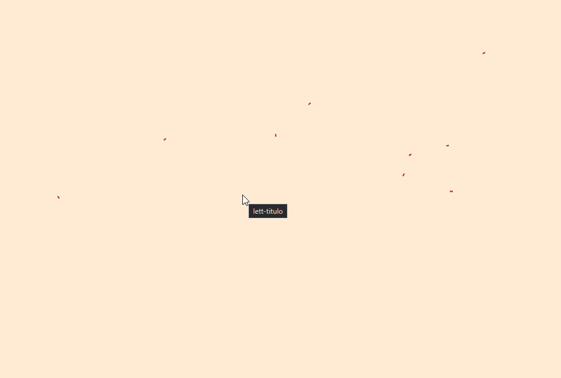
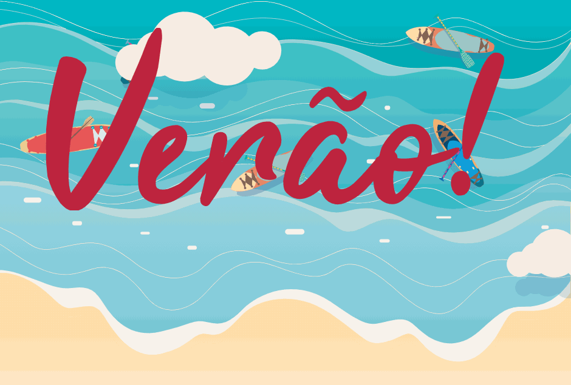
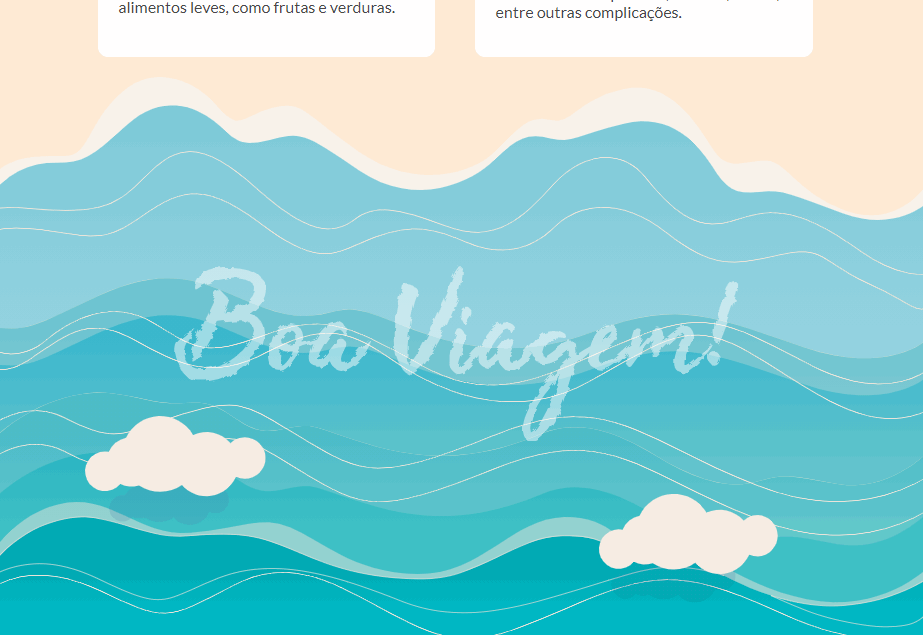

# alura-svg-vectors-and-animations

Esse é o repositório  para o curso Vetores e Animação com SVG: Trabalhando com CSS e JavaScript disponível na [Alura](https://cursos.alura.com.br).

### Animaçao do header

### Animaçao dos cards

### Animaçao do footer
